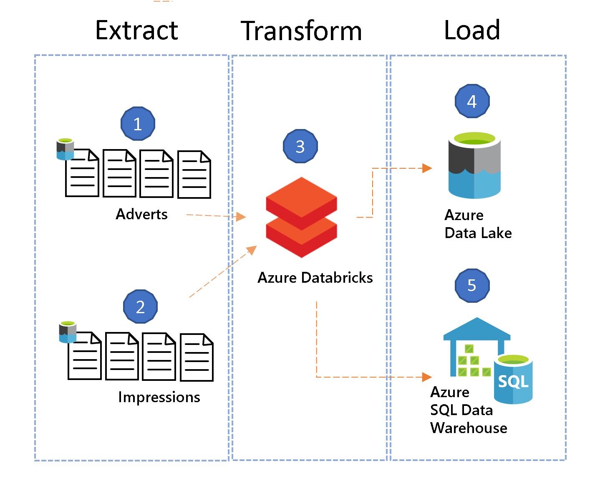

* * *

# An Introduction to Streaming ETL on Azure Databricks using Structured Streaming & Databricks Delta

### Welcome
To read  the full background to this demonstration please read [my blog.](https://medium.com/microsoftazure/an-introduction-to-streaming-etl-on-azure-databricks-using-structured-streaming-databricks-16b369d77e34) Please review the license agreement for this demonstration.

### Introduction
This is a demonstration of a streaming ETL pipeline using Spark, running on Azure Databricks.

### Scenario

Assume the business is in the advertising sector and monitors the volume of adverts displayed (impressions) on certain websites. They are only interested in adverts displaying particular brands. The business is not interested in the usual clicks and conversions. In this scenario, adverts and impressions arrive as a continuous stream / feed of json messages (could be files) from a 3rd party. Adverts contain metadata such as when it was created, a unique identifier, name and which brand it pertains to. Impressions are, when, and on which site, an advert was displayed, including the session and user information. Fortunately we have an advert ID in both to link these however we don’t have any sort of unique key for each impression.

There are some static operational/reference sources which contain slowly changing data:

1.  a SQL DB which contains a list of brands being monitoring
2.  a web application which the operational team uses to maintain a list of domains that are being monitored.

For convenience, assume that both of these data sets are already pre-filtered by a 3rd party based on these specific brands and domains. Adverts are an important source of reference data and _individual adverts need to be easily accessible_ by the operational application.

The set of source tables and the target star schema we need to generate is as follows:

From source to star schema

Note, I’ve excluded the crucial time dimension for brevity, and you’ll also notice I’ve included a batch ETL scenario to showcase how we could implement a Type II slowly changing dimension requirement.

Whilst ever care has been taken to make the scenario and demonstration as realistic as possible, the streaming data is generated by a utility with limitations, so you may find certain qualities about the data set irregular or incomplete. For example, whilst impressions occur more frequently that adverts, the advert IDs are generated randomly (within a fixed range) to ensure some rows will match. Additionally, the data set includes session IDs these are randomly generated for each record, therefore the process of [sessionization](https://databricks.com/blog/2017/10/17/arbitrary-stateful-processing-in-apache-sparks-structured-streaming.html) has not been been covered.

### Minimal Configuration

If you wish to run the pipeline with minimal setup in Azure, you can “stream” files from storage. First [download the sample files](https://github.com/hurtn/databricks/blob/master/streaming-etl/files.zip) and extract the advert and impresssion archives to a local folder. Ensure you have [followed the instructions](https://medium.com/@Nicholas_Hurt/an-introduction-to-streaming-etl-on-azure-databricks-using-structured-streaming-databricks-delta-f0f57ac7aa67#89fd) in part II to set up storage, SQL DW and Databricks. Then use [AzCopy](https://docs.microsoft.com/en-us/azure/storage/common/storage-use-azcopy) or [Azure Storage Explorer](https://azure.microsoft.com/en-us/features/storage-explorer/) to copy these files to Azure Blob or Azure Data Lake. You will need to put them in a folder called “source” below the mount point (basePath) location.

You can skip the next section but first [import the notebook archive](https://docs.azuredatabricks.net/user-guide/notebooks/notebook-manage.html#import-an-archive) using [this URL](https://github.com/hurtn/databricks/blob/master/streaming-etl/Streaming%20ETL.dbc).

### Full Configuration

Please follow the steps detailed in [part II of my blog](https://medium.com/@Nicholas_Hurt/an-introduction-to-streaming-etl-on-azure-databricks-using-structured-streaming-databricks-delta-f0f57ac7aa67) to complete the full setup.

### Workspace Configuration

Launch your Databricks workspace and [import the notebook archive](https://docs.azuredatabricks.net/user-guide/notebooks/notebook-manage.html#import-an-archive) using [this URL](https://github.com/hurtn/databricks/blob/master/streaming-etl/Streaming%20ETL.dbc). Note, that while these notebooks were developed in Scala notebooks, don’t let this deter you. Even if you’re new to Scala (like I was) the APIs are relatively straightforward. The same ETL process could be run using Python (pyspark) with only subtle changes to the code.

Before you run the notebooks, you will need to install the libraries required to connect to Azure Event hubs and Cosmos DB. You can choose to attach these automatically to all clusters or selectively just the cluster(s) that reads from these streams. For convenience I chose install automatically on all clusters.

To read from the Event Hub stream you could follow the steps in [this tutorial](https://docs.microsoft.com/en-us/azure/azure-databricks/databricks-stream-from-eventhubs#attach-libraries-to-spark-cluster) but it’s simple — choose Create -> Library from the drop down menu in the home section and enter the Mavern coordinates:

<pre name="149b" id="149b" class="graf graf--pre graf-after--p">com.microsoft.azure:azure-eventhubs-spark_2.11:2.3.1</pre>

To connect to Cosmos DB, this requires the [Azure Cosmos DB SQL Java SDK](https://docs.microsoft.com/en-us/azure/cosmos-db/spark-connector#connect-by-using-the-java-sdk) which can be installed in a same way as above using Mavern coordinates:

<pre name="3f9c" id="3f9c" class="graf graf--pre graf-after--p">com.microsoft.azure:azure-cosmosdb-spark_2.4.0_2.11:1.3.5</pre>

Complete the workspace configuration by opening the aptly named notebook, called Configuration, and specify the mount name, SQL DW and SQL DB configuration. Note that SQL DW requires [blob storage](https://docs.azuredatabricks.net/spark/latest/data-sources/azure/sql-data-warehouse.html) as an intermediary storage container. Lastly, in this notebook it is worth taking note that we set one of the default Spark parameters to reduce the number of partitions created during a shuffle operation, see [this article](https://medium.com/@manuelmourato25/how-spark-dataframe-shuffling-can-hurt-your-partitioning-28d05fdcb6fa) for more. On a small cluster the default of 200 is far too high, see the section 4 in the notebook.

Next spin up a cluster with all defaults, two worker nodes, no auto-scaling and terminating after n minutes just in case you forget to shutdown the cluster.

Once your cluster is running, head over to the notebook entitled 0\. Setup.

### 0\. Setup

This notebook starts by mounting either on Data Lake gen 2 or Blob storage. The demonstration has been tested using both, without any issues. The good news is that it only needs to be done once and can be used by other notebooks or clusters.

In section 5 we set up the Brands dimension table manually using Spark SQL. Note the “USING DELTA” specification in the create table command. As described in part 1, we would expect this table to be maintained by an upstream application, or at least provide some sort of transaction logs to keep the table in sync. Purposefully, one of the brands have been left out because in notebook 6 we’ll demonstrate how we could potentially handle a “late arrive dimensions” scenario, albeit in batch mode. You will notice some additional fields for [SCD type II](https://www.kimballgroup.com/2008/09/slowly-changing-dimensions-part-2/) have been defined which is maintained by notebooks 7.1-2.

### 1\. Populate the Domain dimension

Using either 1a or 1b you will need to populate the next dimension table. For those who followed the set up in part II, ensure your SQL DB parameters have been configured in the Configuration notebook and then run 1a, otherwise run 1b.

### 2\. Stream Ingestion

To run the notebooks from now on you will either need to start the json generator and the Streaming Analytics job or you would need to have uploaded the set of sample files to blob.

In this section we’ll look at some common “transformation” scenarios, namely renaming fields, data type conversions, surrogate keys and de-duplication. Joins will be covered in the next notebook. It’s worth noting that [invalid or bad records](https://docs.azuredatabricks.net/spark/latest/spark-sql/handling-bad-records.html#handling-bad-records-and-files) can be handled during ingestion but are not covered in this demonstration.

From here on it may be helpful to reference the following diagram with reference to source and star schema diagram provided in part I.

This diagram attempt to represent the key stages of pipeline with reference to the associated notebook.command. In notebook 2 you can see we ingest two streams and land them their respective delta locations. They’re not technically “tables” until you have defined them as such using the create table or temp view statement, for now they’re just parquet files in the specified location.

Reading from Cosmos DB in command 2.1 doesn’t perform any major transformations, but simply casts each field to the associated type, adds a timestamp and selects the fields of interest before writing to the dimensions location. As per best practice, it would be advisable to store an unfiltered, unaltered, original copy of the data in the data lake, and this could be achieved by writing the stream directly to the data lake first. Whilst we didn’t assign any surrogate keys to each adverts, to my knowledge possible to generate monotonically increasing IDs during a streaming operations so java UUIDs or some hashing function may be the best option. An example of this shown in 2.3 below.

In 2.2 we read a stream of data from Event hub into a data frame and then perform a number of transformations in 2.3\. Let’s go through these in more detail…

We start by creating a Scala [User Defined Function](https://docs.azuredatabricks.net/spark/latest/spark-sql/udf-scala.html#user-defined-functions-scala) (UDF) to generate UUIDs for each record. In python you should use [Pandas or Vectorized UDFs](https://docs.azuredatabricks.net/spark/latest/spark-sql/udf-python-pandas.html#pandas-user-defined-functions) for improved performance. In this scenario we have prefixed each UUID with the unix timestamp of when the record (message) was queued in event hubs. This is probably unnecessary but is to further reduce the possibility of any collision occurring. If you wish to use a hash instead of UUID, an example of the built [sha1](https://docs.azuredatabricks.net/spark/latest/spark-sql/language-manual/functions.html#sha1) function of certain fields can be found on line 26.

The next transformation takes place on line 19 to convert the [body of the event hub message](https://docs.azuredatabricks.net/spark/latest/structured-streaming/streaming-event-hubs.html#schema) from binary to string applying the expected schema defined on line 7\. In the next few lines we cast the fields to the appropriate data types and add a timestamp. In line 24 we select the fields of interest and then generate two unique hash keys one for de-duplication or the other as a surrogate key for the sessions dimension. On line 27 we extract the hour from impressionDate to be included in the partitioning strategy which improves performance of the hourly ranking operation run in notebook 7.2\. In line 28 we simply rename the adID field for ease of reference later. Lines 29 and 30 are linked because [streaming de-duplication](https://spark.apache.org/docs/latest/structured-streaming-programming-guide.html#streaming-deduplication) requires storing data from previous records in order to filter out the duplicates. Without a watermark, state will increase potentially to the point where you run out of memory. If you want to de-duplicate across millions of keys you may need to consider [RocksDB](https://docs.azuredatabricks.net/spark/latest/structured-streaming/production.html#optimize-performance-of-stateful-streaming-queries). To monitor the amount of state being stored, expand the streaming status and review the number of distinct keys in the aggregated state. Note this will only occur at the write operation (action) due to Spark’s lazy evaluation feature.

Next, in 2.4 we write out the transformed impressions dataframe in Delta format to a “staging” location, partitioning by the enqueued date and hour. This is going to be a different partitioning strategy to the fact table, because in the staging area we might want to process the data based on the time the events arrived (were enqueued) but the business might want to query the detailed fact table (in the data lake) by event time.

Lastly, we write the sessions dimension data to Delta, with it’s surrogate key and drop duplicates. At this point we haven’t streamed anything to SQL DW, with reference to the diagram above, that will occur in notebook 5\. Even though we running each notebook and command sequentially, once all the notebooks (and streams) are running the end-to-end pipeline will be running with minimal latency between ingestion and writing out to SQL DW.

In this notebook you may have noticed the use of [checkpoints](https://spark.apache.org/docs/latest/structured-streaming-programming-guide.html#recovering-from-failures-with-checkpointing). One of the great benefits of Structured Streaming, they ensure fault-tolerance when you encounter failures and guarantee exactly once processing when you restart your streaming process.

### 3\. Stream Processing

At the beginning of notebook 3 we start by reading the advert and impressions streams we’ve just initialised in notebook 2\. It may seem redundant reading and writing to streams so frequently but this allows us to persist the data while we build up [various layers of our data lake](https://www.jamesserra.com/archive/2017/06/data-lake-details/), whilst still running the pipeline as stream.

3.3 showcases a different type of UDF, one that extracts the domain from the URL so that we can join our static domains table (3.4) to the stream in order to obtain the ID for that domain. The output (all fields from impressions, together with the domain ID are stored in another dataframe which we’ll continue to use in the next join lower down.

> Hopefully this gives you an idea of how you might implement some business logic in a UDF however you need to be conscious of a potential performance penalty you may incur. To implement this join we converted the dataframe to a view and expressed the join in SQL. At this point it’s worthwhile reviewing the [supported join operations](https://spark.apache.org/docs/latest/structured-streaming-programming-guide.html#support-matrix-for-joins-in-streaming-queries) for streaming and static datasets.

The next join in 3.5 implements a watermark on both streaming sets (adverts and impressions) to avoid unbounded state which may result in out of memory issues. The downside is after this watermark has been exceeded the records won’t join and will need to be handed in of four ways:

1.  A batch (merge) operation will need to perform an left anti-join to find all the impressions that don’t exist in the fact table
2.  Perform a stream-static (impressions-adverts) join depending on size of the advert dataset as may result in poor streaming performance
3.  Join with an external source such as Cosmos DB
4.  UDF which executes a look-up against Cosmos DB

The last two warrant a blog post in their own right and would incur significant [RUs](https://docs.microsoft.com/en-us/azure/cosmos-db/request-units) depending on the velocity of the impressions. In fact, all of these options would need to be carefully considered according the size of the referenced dataset (in our case adverts) and the velocity of impressions. In an ideal scenario you would want to perform an in-memory join but will depend on the aforementioned criteria, as well as budget and specific business requirements.

In 3.6 we place the most recent brand records in a dataframe (by means of the current_flag=TRUE filter condition) and join these against the output of the previous impressions-adverts join to obtain the brand key. A watermark is specified to limit state particularly as we are conducting an outer join, so the engine needs to know how long to store impressions before they won’t match a brand. Once the watermark has been exceeded, and if no join has occurred it will output a row with brand key of 0\. This will catered for in our late arriving dimensions scenario in notebook 6\. Certain fields are dropped as they become redundant and the output is written to fact impressions location (3.7) partitioned by impression date and hour.

### 4\. Aggregation

In most analytical scenarios reports seldom require the lowest level detailed data. Usually they are run at some level of aggregation. Therefore for this demonstration I want to store only aggregated results in SQL DW but still retain a copy of the detailed level fact table in the datalake. This will also ensure that SQL DW performance is optimal and storage costs are minimised. Your Power BI reports would run most reports off SQL DW unless detail level data was requested, at which point you would run your query against the data lake using the [Spark connector](https://docs.azuredatabricks.net/user-guide/bi/power-bi.html).

The purpose behind notebook 4 is to read the stream of facts, aggregate them every minute (based on event time — impression date) using a watermark of 2 hours to ensure limit the amount of state required. 2 hours was specifically chosen because our stream generator generated events with timestamps one hour behind actual event time. We therefore have an additional one hour buffer in case for whatever reason it takes some time before the event is consumed by Databricks.

Lastly, note the filter which ensures that impressions of brands which could not match a record in the brand table (i.e. brand key of 0) are excluded from these aggregates. This is to ensure we don’t have to correct the data in SQL DW later but instead “hold” these records back until we have an associated entry in the brand table. This will be dealt with by notebook 6\. The aggregates are then persisted to delta partitioned by the leading impression date.

### 5\. Streaming to SQL Data warehoues

To run this notebook, ensure you SQL DW is running.

Notebook 5 section 1 simply reads the aggregates from delta and writes them to SQL DW. If you are running the pipeline yourself, the Configuration notebook needs to be updated with the necessary details of your SQL DW and the blob storage account and container you’ve chosen. SQL DW [uses Azure Blob storage and PolyBase](https://docs.azuredatabricks.net/spark/latest/data-sources/azure/sql-data-warehouse.html) in SQL DW to transfer large volumes of data efficiently between an Azure Databricks cluster and a SQL DW instance.

Sections 2–3 simply streams the adverts and sessions data to SQL DW. You should now be able to view the data in the data warehouse…

### 6\. Late arriving dimensions

From notebook 6 onwards we leave the world of streaming and enter batch mode, for operations which are better suited to this style of processing. Mostly because they require update operations which have higher levels of latency, unsuitable for a low latency streaming environment.

The notebook is very well documented but in summary, once we include the “missing” brand in the dimension table, we update all the records (files) with a brand key of 0 with the new key we have just added. Then in 6.5 we select all these records, calculate the aggregates with identical code (using write instead of writestream) and write these to both the datalake and SQL DW.

### 7\. 1 Slowly Changing Dimensions — Type II

Normally, slowly changing dimensions type II are used to track attribute changes over time, such as when an entity’s address changes. In order to construct some sort of “synthetic”, slowly evolving attribute in our scenario we will use the position (rank) of each brand, based on the number of impressions, calculated at scheduled intervals. The SCD Type II implementation will record each brands position over time with start and end dates and an additional current indicator which will also serve as a partition key. This will ensure that as our table grows over time, performance to fetch the most current records will not degrade.

A view is used to simplify the final merge statement, which creates new entries where the rank has changed and updates prior entries with an end date.

Finally we create a view to calculate hourly totals which will be run on a scheduled basis in the next notebook.

### 7.2 SCD — Scheduled

We calculate the hourly totals and rank of each brand, then update the brands dimension table in SCD Type II fashion. The complete brands and domains dimension tables are overwritten in SQL DW. This may not be the most efficient means to keep the warehouse in sync but for small tables it may be acceptable. Where this overwrite causes any outage the typical load and switch mechanism may be work by maintain two copies of the same table with a view that points to the most up to date version.

### 8 Batch Corrections

In order to incorporate data which occurred beyond the watermark, some corrections need to be run in batch mode. You will notice the same tables already defined so some filter condition should be implemented to ensure no overlap takes place, i.e. data streaming in doesn’t clash with the bash process. You will notice that in general this is very similar code to notebook 2.

Initially we will obtain the set of impression keys which are not represented in the fact table, and try to join them up to the associated adverts, brands and domains. The results then need to be persisted to a temporary location before pushed to SQL DW.

### Conclusion

I hope this blog series has given you an introduction into building a streaming (and batch) ETL pipeline using Azure Databricks. As data volumes continue to rise and traditional ETL processes are placed under greater demand, I expect more companies will look to big data technologies to run their ETL workloads at scale. Particularly, as open-source Spark and Databricks continue to evolve, I am confident these technologies will be more accessible and offer powerful features which light up and unlock certain scenarios. Even our own Data Factory recently [previewed Data Flows](https://www.jamesserra.com/archive/2018/12/azure-data-factory-data-flow/) which offer transformation capabilities which execute spark jobs in Databricks and scale out as needed. Whilst Data Factory and this Data Flows feature are designed more for batch processing, it is yet another example of how data integration and ETL tools are adapting to leverage the power of cloud and distributed computation engines such as Spark, to run massively scalable ETL workloads in the cloud.

### Remember to clean up your resources

To avoid any unnecessary costs, after you have finished running this demo, you should stop/terminate the cluster. To do so, from the Azure Databricks workspace, from the left pane, select Clusters. For the cluster you want to terminate, move the cursor over the ellipsis under Actions column, and select the Terminate icon.

If you do not manually terminate the cluster it will automatically stop, provided you selected the Terminate after __ minutes of inactivity checkbox while creating the cluster. In such a case, the cluster will automatically stop if it has been inactive for the specified time. **Additionally please ensure you stop SQL DW, the data generator and the Streaming Analytics job.**
